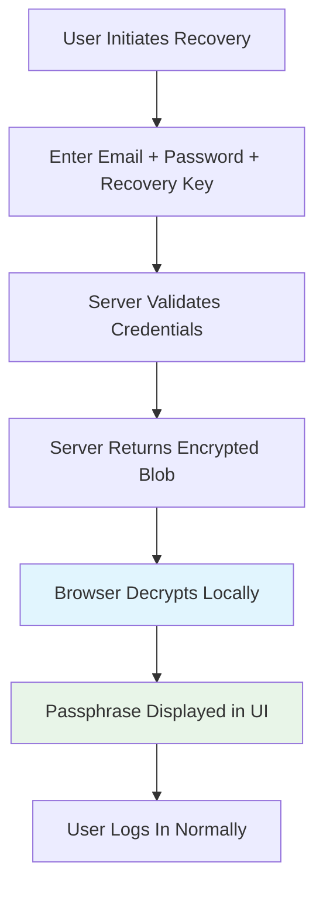

# Zero-Knowledge Encryption Implementation

## Overview

CognitiveInsight.ai follows the MyImaginaryFriends.ai Zero-Knowledge Architecture, ensuring true client-side encryption where user data is never accessible by the platform, even during recovery operations.

## 🔐 Implementation Details

### Authentication Flow

1. **Signup:**
   - User creates a passphrase (minimum 8 characters with validation)
   - Passphrase is used to derive encryption keys using PBKDF2 with SHA-256 (100,000 iterations)
   - A recovery key is generated (64-character hexadecimal)
   - Passphrase is encrypted with the recovery key and stored as an encrypted blob
   - **Zero-Knowledge Guarantee:** Server never sees the plaintext passphrase

2. **Regular Login:**
   - Requires: Email, Password, Passphrase
   - Passphrase is validated client-side
   - User data is decrypted in the browser using the passphrase
   - Passphrase is stored in sessionStorage for the session

3. **Zero-Knowledge Recovery:**
   - Requires: Email, Password, Recovery Key
   - Server returns the encrypted passphrase blob
   - Browser decrypts the blob using the recovery key (client-side only)
   - Recovered passphrase is displayed in the UI (never emailed)
   - User can copy the passphrase for future use

### Security Features

- **AES-GCM 256-bit encryption** for all user data
- **PBKDF2 key derivation** with high iteration count
- **Client-side only decryption** - server never sees plaintext
- **No email delivery** of sensitive data
- **Session-based storage** - data becomes unreadable on logout

### Zero-Knowledge Guarantees

| Feature | Implementation |
|---------|----------------|
| Server Passphrase Access | ❌ Never - stored encrypted only |
| Recovery Email Delivery | ❌ Never - shown in browser only |
| Client-Side Decryption | ✅ Always - using Web Crypto API |
| Plaintext Logging | ❌ Never - not logged anywhere |
| Session Security | ✅ SessionStorage only |

## 🔄 Recovery Process



## 🔧 Technical Implementation

### Files Modified

1. **`src/services/recoveryService.ts`**
   - Implements `recoverPassphraseZeroKnowledge()`
   - Returns encrypted blobs for client-side decryption
   - No email sending capabilities

2. **`src/components/auth/auth-form.tsx`**
   - Zero-knowledge recovery UI
   - Client-side passphrase display
   - Copy-to-clipboard functionality
   - Clear zero-knowledge messaging

3. **Environment Configuration**
   - Removed SMTP configuration
   - No email service dependencies

### Code Example

```typescript
// Zero-Knowledge Recovery Implementation
export async function recoverPassphraseZeroKnowledge(
  userId: string, 
  recoveryKey: string
): Promise<{ passphrase: string | null; success: boolean; error?: string }> {
  // Get encrypted blob from server
  const encryptedBlob = await getEncryptedPassphraseBlob(userId);
  
  // Client-side decryption only
  const decryptedPassphrase = await decryptPassphrase(encryptedBlob, recoveryKey);
  
  return {
    passphrase: decryptedPassphrase,
    success: true
  };
}
```

## 🏛️ Compliance with MyImaginaryFriends.ai Standards

✅ **Client-Side Encryption**: All data encrypted before leaving browser  
✅ **Zero Server Knowledge**: Server never sees passphrases in plaintext  
✅ **Recovery Safety**: Passphrase decrypted locally and shown in browser  
✅ **No Email Transmission**: Sensitive data never sent via email  
✅ **Session Security**: Encryption keys stored in sessionStorage only  

## 🔗 Related Documentation

- [MyImaginaryFriends.ai Zero-Knowledge White Paper](./zero-knowledge-whitepaper.md)
- [Encryption Architecture](./encryption-architecture.md)
- [Security Audit Report](./security-audit.md)

---

**Implemented by:** CognitiveInsight.ai Development Team  
**Compliance:** MyImaginaryFriends.ai Zero-Knowledge Architecture v1.0  
**Last Updated:** July 7, 2025
